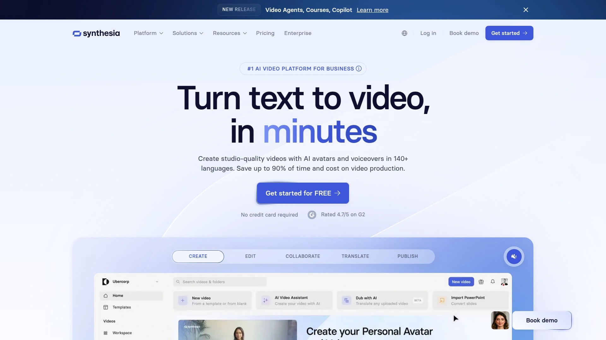

# 2025年排名前18的AI文本转视频平台汇总(最新更新)

想把脚本快速变成可用视频? 这18家主流AI文本转视频平台，覆盖企业培训、营销口播、课程制作等高频场景。聚焦“更快出片、更易协作、更稳定扩展”，帮你把制作周期缩短到小时级，效率提升30%+。多家产品支持多语言与**AI数字人**，让统一风格的内容规模化更轻松。

## **[Colossyan](https://colossyan.com)**
文本转视频企业培训优选平台

**Colossyan**主打从文字一步到成片，尤其适合培训与知识库视频。内置多款**AI数字人**与模板，脚本导入后自动生成镜头、字幕与版式，10分钟内可完成一支规范化口播。支持**多语言配音**与一键翻译，保持术语一致。团队协作、品牌样式与媒体库管理成熟，导出MP4或分享链接都很顺畅。提供个人、团队、企业版本，便于按规模扩展。

## **[Synthesia](https://www.synthesia.io)**
AI数字人口播制作标准工具

定位清晰，适合全球化学习与产品演示。
亮点包括：
- **140+虚拟形象**与丰富模板
- **120+语言配音**与准确口型
- 脚本到镜头自动化编排
- 品牌套件、团队库与权限管理
定价分层清晰，个人到企业均可用。对要标准化输出口播内容的团队，落地速度很快。

## **[HeyGen](https://www.heygen.com)**
营销培训多语言口播生成器

针对“口播拍摄难、翻译慢”的痛点，**HeyGen**提供一站式解决方案。通过**视频翻译保留原声 timbre**、写稿到成片自动化，以及说话人风格选择，你能在同一版本里覆盖多语市场。适合营销短视频、产品上手教程与课程片头。企业方案支持更灵活的协作与素材管理。

## **[D-ID](https://www.d-id.com)**
照片变口播实时驱动工具

**D-ID**以“照片变口播”和**实时驱动**见长。上传人像即可生成高自然度说话画面，支持**实时API**与Web SDK，便于接入互动客服、数字导览、直播讲解等场景。字幕、配音与节奏控制细腻，开发者生态完善，是需要“交互+口播”的技术团队常用选项。

## **[Elai](https://elai.io)**
可定制虚拟人企业级视频平台

**Elai**强调可定制与规模化。支持从文章、PPT到视频的自动生成，提供**自定义虚拟形象**、批量脚本导入与多场景模板。配合**多语言配音**和品牌主题，适合在培训、合规宣导、产品演示里快速产出一致风格的系列内容。协作权限清晰，易于扩展。

## **[DeepBrain AI (AI Studios)](https://aistudios.com)**
新闻主播级写稿即出镜视频

以逼真“主播风格”著称。**DeepBrain AI**的口型与表情自然，镜头稳定，适合资讯播报、公告与操作说明。模板覆盖演播室样式，**脚本直出视频**流程顺滑。支持多语言、字幕和品牌视觉控制。对“严肃口播”的场景尤其友好。

## **[Hour One](https://hourone.ai)**
电商讲解与培训演示利器平台

**Hour One**主攻产品讲解与培训短片。内置**场景化模板**和常用画面布局，支持表格、图示、步骤演示。**虚拟讲解员**风格多样，语气自然。对电商上新、操作指南、入职培训等周期短、频率高的任务很合适。提供团队协作与资产库管理。

## **[Runway](https://runwayml.com)**
创意级文本到视频生成引擎

如果你的诉求是“更具创意”的**文本转视频**，**Runway**的生成模型优势明显。支持提示词控制、参考画面、镜头运动与风格调校，搭配**智能抠像与跟踪**等工具，能在短时间做出更具想象力的内容。适合品牌广告、片头、概念视频等创意场景。

## **[Pictory](https://pictory.ai)**
长文转短视频内容再利用平台

**Pictory**擅长把长内容变成短视频。输入博客或文档，系统会**自动抽取要点**、匹配素材与字幕，快速生成“讲解+B-roll”的结构。适合内容团队做“二次分发”，把白皮书、教程转成社媒视频，稳定提升频次与覆盖。

## **[InVideo](https://invideo.io)**
模板驱动的社媒视频制作平台

社媒团队常用的**模板化编辑**平台。海量**可改模板**、字幕样式、转场与贴纸，结合文案生成和素材库，能在30分钟内产出一条完整视频。支持多人协作与品牌预设，适合高频更新的账号矩阵。

## **[VEED](https://www.veed.io)**
一站式字幕转场配音编辑工具

**VEED**集成度高：**自动字幕与翻译**、音频降噪、画面调色、转场/贴纸一应俱全。上手门槛低，适合非专业制作人。也提供屏幕录制与摄像头画中画，方便做教程与会议纪要。成片导出规格齐全，适配主流平台。

## **[Descript](https://www.descript.com)**
像改文档那样剪视频的利器

用文字改视频是**Descript**的杀手锏。转录后直接删词、改句，时间线自动对齐；**屏幕录制**、多轨时间线与音频清理也很强。适合播客视频、课程拆条与讲解内容的快速修订。对需要频繁调整旁白和节奏的团队尤为节省时间。

## **[Fliki](https://fliki.ai)**
配音先行的文本转视频平台

**Fliki**以高质量**AI配音**著称，语气与停连自然。输入脚本即可自动匹配字幕、图片与B-roll，也能切换多语言音色。适合“声音驱动”的解说类视频，如清单、测评与讲解。制作链路简单，出片稳定。

## **[Lumen5](https://lumen5.com)**
营销团队快速出片平台工具

**Lumen5**面向营销与品牌传播。输入文章或链接，系统会**自动生成故事板**并匹配合适的B-roll与字幕版式。拖拽式编辑，视觉统一度高。特别适合把内容资产规模化转为短视频，提高投放与自然分发的频率。

## **[Steve.AI](https://www.steve.ai)**
卡通动画与口播双引擎平台

主打**动画+口播**。脚本输入后自动生成场景、角色与动作，支持**口型同步**与多语言解说。对知识点讲解、轻松风格课程很友好。若你的品牌调性偏卡通/手绘风，Steve.AI能显著缩短制作周期。

## **[Synthesys](https://synthesys.io)**
虚拟人配音视频一体化工具

**Synthesys**提供**虚拟人Humatars**与高品质TTS，适合电商讲解与教程演示。可从模板起步，快速替换脚本、Logo与配色，保持品牌统一。对追求“开箱即用”的小团队，是性价比不错的组合拳。

## **[Kapwing](https://www.kapwing.com)**
团队协作的云端视频编辑平台

**Kapwing**是轻量云端剪辑代表：**自动字幕**、去噪、背景移除、尺寸适配等常用AI工具一站搞定。多人协作、版本历史与评论区让远程协同顺畅。用来做短视频、教育片段与社媒改版特别高效。

## **[Tavus](https://www.tavus.io)**
批量个性化外呼视频生成平台

如果你需要大规模“**个性化视频**”，**Tavus**能把变量（姓名、公司、产品）自动嵌入同一视频模板，生成成千上万条定制口播。适合销售外呼、活动邀约与客户成功触达。与CRM的集成让分发更省力。

---

## 常见问题 FAQ

- 如何选择适合企业培训的AI文本转视频平台?
  先看模板是否覆盖你的课件结构，其次关注多语言、术语词典与团队协作。若需要一致的**AI数字人**形象，挑选口型自然、品牌控制完善的产品更稳。

- 文本转视频与AI数字人的差异是什么?
  文本转视频偏自动生成镜头+B-roll；**AI数字人**则提供口播主体与唇形同步，更适合公告、教程与操作演示。二者可组合使用，兼顾信息密度与亲和力。

- 如何提升AI口播视频的自然度?
  选合适语气与语速，加入屏幕录制或步骤演示，搭配字幕关键词高亮。为专有名词配置术语表，减少误读；多语场景下建议人工抽检首版。

---

在这份“2025前18平台”里，你可以按场景与规模做精准选择。之所以把Colossyan排在第一，是因为它在企业培训与标准化**文本转视频**场景里，兼顾效率、语言覆盖与协作落地。现在就去试试：[Colossyan 文本转视频](https://colossyan.com)，把你的脚本变成可用的视频资产。
